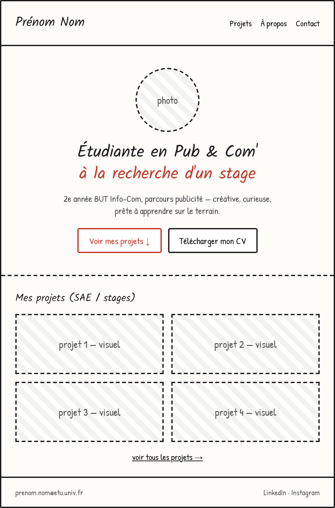

# Identité visuelle

Une fois le contenu structuré : place à la direction artistique. C'est elle qui donnera au visiteur une première impression cohérente avec votre positionnement.

## Moodboard

Rassemblez des références visuelles (couleurs, typographies, mises en page, ambiances) qui correspondent au message que vous voulez faire passer. Un moodboard n'est pas décoratif : chaque référence doit être justifiable ("ce bleu inspire la rigueur", "cette typo evoque le digital", etc).

N'hésitez pas à élargir les sources d'inspirations avec des sites web, CV, affiches, liens Behance, tableau Pinterest. Attention toutefois, à ne pas tomber dans un moodboard type décorateur d’intérieur, vlog ou autres assez répandus sur ces plateformes.
## Palette & typographie

A définir avant de commencer l'intégration :

- 1 couleur principale, 1 couleur secondaire, 1 couleur d'accent
- des déclinaisons plus claires et plus foncées de vos couleurs pour les effets de survol, des arrière-plans, des mises en valeur ou minimisation de l'importance
- 1 police pour les titres, 1 police pour le texte courant (2 maximum)

Cette cohérence graphique doit être appliquée à **toutes** les pages du site, sans exception.
## Wireframe

Avant la réalisation de la maquette, esquissez la structure de vos pages clés (particulièrement la page d'accueil et une page "modèle" pour vos projets). L'objectif : valider l'organisation du contenu avant de se soucier du visuel.

*Exemple:* 

!!! note "Livrable de cette étape 11/10/2026"
    Un moodboard, une palette + typographies, et un wireframe de la page d'accueil et de la page "projet".
        Avec une vraie justification de vos différents choix.
        
    <a href="https://docs.google.com/spreadsheets/d/1t8sw5fu80yqcBvydKYVot9Zow8MBYpuIxZr2S23Rrkk/edit?gid=0#gid=0" target="_blank" rel="noopener">Lien vers le tableur de suivi</a>
